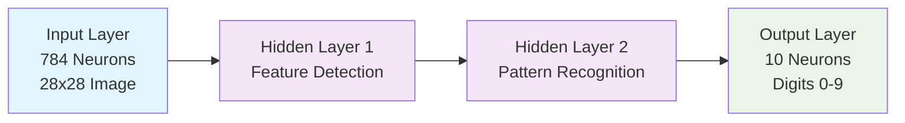
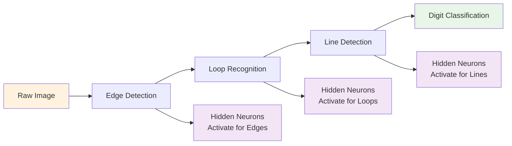
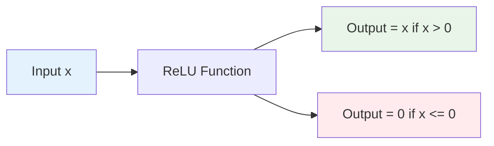
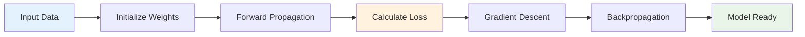
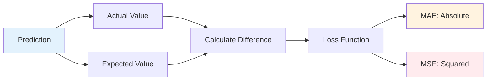
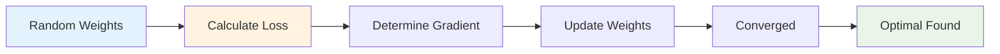
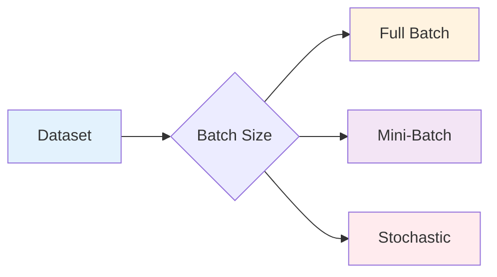
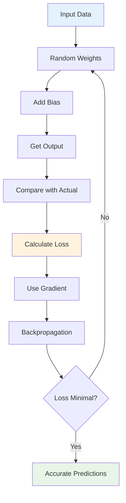
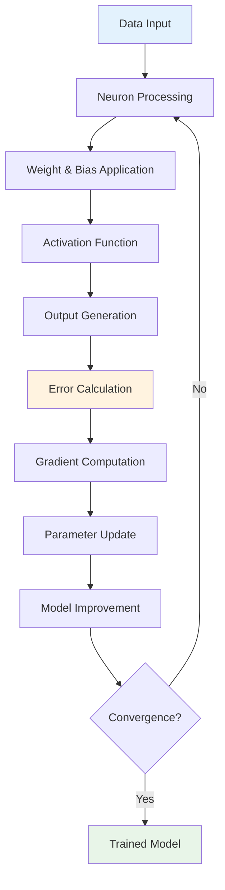

# Machine Learning Notes

## Table of Contents

1. [Machine Learning Crash Course Resources](#machine-learning-crash-course-resources)
2. [Types of Machine Learning Systems](#types-of-machine-learning-systems)
3. [Python Data Science Libraries](#python-data-science-libraries)
4. [Conda Environment Management](#conda-environment-management)
5. [Mathematical Examples](#mathematical-examples)
6. [Supervised Learning](#supervised-learning)
   - [Classification](#classification)
   - [Supervised Machine Learning Process](#supervised-machine-learning-process)
   - [Linear Regression](#linear-regression)
7. [Unsupervised Learning](#unsupervised-learning)
8. [Reinforcement Learning](#reinforcement-learning)
9. [Generative AI](#generative-ai)
10. [AI/ML Roles and Responsibilities](#aiml-roles-and-responsibilities)
11. [Neural Networks & Deep Learning](#neural-networks--deep-learning)
    - [Neural Network Structure](#neural-network-structure)
    - [How Neurons Work](#how-neurons-work)
    - [Activation Functions](#activation-functions)
    - [Training Process](#training-process)
    - [Cost Function & Loss](#cost-function--loss)
    - [Gradient Descent](#gradient-descent)
    - [Parameters vs Hyperparameters](#parameters-vs-hyperparameters)
12. [Vector DB](#vector-db)
---

## Machine Learning Crash Course Resources

- https://developers.google.com/machine-learning/crash-course
- https://developers.google.com/machine-learning/crash-course/linear-regression
- https://developers.google.com/machine-learning/intro-to-ml/what-is-ml
- https://developers.google.com/machine-learning/problem-framing
- https://pair.withgoogle.com/quidebook/

---

## Types of Machine Learning Systems

ML systems fall into one or more of the following categories based on how they learn to make predictions or generate content:
- Supervised learning
- Unsupervised learning
- Reinforcement learning
- Generative AI

In basic terms, ML is the process of training a piece of software, called a model, to make useful predictions or generate content from data.

---

## Python Data Science Libraries

NumPy for manipulation of homogeneous array-based data, 
Pandas for manipulation of heterogeneous and labeled data, 
SciPy for common scientific computing tasks, 
Matplotlib for publication-quality visualizations, 
IPython for interactive execution and sharing of code, 
Scikit-Learn for machine learning

### Key Libraries Overview

- **IPython and Jupyter**: these packages provide the computational environment in which many Python-using data scientists work.
- **NumPy**: this library provides the ndarray for efficient storage and manipulation of dense data arrays in Python.
- **Pandas**: this library provides the DataFrame for efficient storage and manipulation of labeled/columnar data in Python.
- **Matplotlib**: this library provides capabilities for a flexible range of data visualizations in Python.
- **Scikit-Learn**: this library provides efficient & clean Python implementations of the most important and established machine learning algorithms.

---

## Conda Environment Management

### Environment Commands

```bash
conda create -n <env-name>  # Create new environment 
conda info --envs           # Get list of all environment
conda activate myenvironment # Activate or use environment 
conda install matplotlib    # Install packages
conda install --name myenvironment matplotlib  # Install packages in specific environment
conda env export > environment.yml   # Export environment image
```

### Resources

- https://docs.conda.io/projects/conda/en/latest/user-guide/cheatsheet.html

---

## Mathematical Examples

### Without squaring
4, 5, 6, 7
22/4 = 5.5

### With squaring
16 25 36 49
126/4 = 31.5

### Without squaring
.1 .2 .4 .5
1.2/.4 = .3

### With squaring
.1 .04 .16 .25
0.55/4 = 0.1375

---

## Supervised Learning

Supervised learning models can make predictions after seeing lots of data with the correct answers and then discovering the connections between the elements in the data that produce the correct answers.

Two SubTypes:
- regression

### Classification

- Classification models learn to predict possibilities or possibilities from labeled data.
- Classification models predict discrete values, such as whether an email is spam or not spam.
- Two types of classification:
  - Binary classification
  - Multiclass classification

### Supervised Machine Learning Process

- **Data**: The data used to train the model.
- **Model**: The software that makes predictions or generates content.
- **Training**: The process of teaching the model to make predictions or generate content.
- **Evaluation**: The process of testing the model's performance.
- **Inference**: The process of using the model to make predictions or generate content.

### Linear Regression

- Linear regression is a type of supervised learning that predicts continuous values.
- Linear regression models learn to predict a continuous value by finding the best-fit line that minimizes the distance between the predicted values and the actual values.

---

## Unsupervised Learning

- Unsupervised learning models find hidden patterns in data without labeled examples.
- Unsupervised learning models learn from unlabeled data.
- Two types of unsupervised learning:
  - Clustering
  - Dimensionality reduction

---

## Reinforcement Learning

- Reinforcement learning models learn to make a sequence of decisions in an environment to maximize a cumulative reward.
- Reinforcement learning models learn from trial and error.

---

## Generative AI

- Generative AI models learn to generate new content, such as images, text, or music.
- Generative AI models learn from existing data.

---

## AI/ML Roles and Responsibilities

- **Software Engineer**: write specialized software for command execution
- **Machine Learning Engineer**: write software responsible for networks by iterating over the algorithm mappings, collect data and train neural networks
- **Machine Learning Researcher**: perform research on how to extend state-of-the-art in ML, publish papers and maintain documentation
- **Machine Learning Scientist**: go through academic & research literature to find ways to implement state-of-the-art technology to the current application
- **Data Scientist**: examine data and gain insights; further discuss and present the insights to the team
- **Data Engineer**: organize data and saving it in an easily accessible, secure and cost-effective way
- **AI Product Manager**: help decide what is feasible and valuable, and what to finally build; manage deadlines and coordinating with the team

### AI Engineers/Trainees Responsibilities

AI engineers/trainees should be able to collect the right type of data, build algorithms based off of it and then assemble various modules of the project to ship it.

---

## Neural Networks & Deep Learning

### Neural Network Structure

Neural networks are inspired by the brain, consisting of layers of neurons that hold numbers between 0 and 1. The video uses the example of recognizing handwritten digits to illustrate how neural networks function.

**Key Components:**
- **Input Layer**: 784 neurons for a 28x28 pixel image
- **Hidden Layers**: Process information and detect patterns
- **Output Layer**: 10 neurons, each representing a digit from 0 to 9



### How Neurons Work

When Neuron gets hit, it's called activation i.e. Neuron got activated.

**Neuron Function:**
- Each neuron holds an activation value (0 to 1)
- Activations are influenced by the previous layer
- Determined by weighted sums and biases
- Think Neuron as function, when you pass any input it determine value, i.e. next Neuron

```mermaid
graph LR
    A[Input<br/>x1, x2, x3] --> B[Weights<br/>w1, w2, w3]
    B --> C[Bias<br/>+b]
    C --> D[Weighted Sum<br/>Sum(wi*xi) + b]
    D --> E[Activation Function<br/>Sigmoid/ReLU]
    E --> F[Output<br/>0 to 1]
    
    style A fill:#e3f2fd
    style F fill:#e8f5e8
```

**Pattern Recognition Flow:**


### Activation Functions

**Sigmoid (Old School):**
- Squishes values between 0 and 1
- Formula: sigma(x) = 1/(1 + e^(-x))

**ReLU (New Way):**
- Rectified Linear Unit
- Formula: f(x) = max(0,x)
- More efficient and commonly used



### Training Process

**Complete Training Pipeline:**


**Training Data Structure:**
- **Features**: Input data
- **Labels**: Expected output

**Model Testing**: Also called Inference

### Cost Function & Loss

**Cost Function Purpose:**
- Measures how wrong the answer is
- Weights + bias = cost function
- Goal: Minimize cost function

**Loss Functions Comparison:**

| Function | Formula | Characteristics | Use Case |
|----------|---------|----------------|----------|
| **MAE** | |y - y_hat| | Less sensitive to outliers | When outliers shouldn't dominate |
| **MSE** | (y - y_hat)^2 | More sensitive to outliers | When large errors should be penalized |

**Example:**
- Actual value = 21
- Expected value = 24
- MAE = 24 - 21 = 3
- MSE = (24 - 21)^2 = 9



### Gradient Descent

**Gradient Descent Mechanism:**
- Mechanism to adjust weight and bias to reduce loss or cost
- Gradient = wrapper on top of cost function = 3D valley hill slope
- Suggests where to move to minimize gradient
- Higher gradient means more effects on output data

**Convergence:**
- Point where making changes to weight and bias would not result in any significant loss minimization
- Model stabilizes and stops making substantial changes



### Parameters vs Hyperparameters

**Parameters:**
- Weights, bias are variables derived by model
- Learned during training

**Hyperparameters:**
- As user you give it
- Control different aspects of training

**Common Hyperparameters:**

| Hyperparameter | Purpose | Impact |
|----------------|---------|--------|
| **Learning Rate** | Controls convergence speed | Too low: slow convergence<br/>Too high: never converges |
| **Batch Size** | Examples processed before update | Full batch: heavy operation<br/>Stochastic: one example<br/>Mini-batch: balanced approach |
| **Epochs** | Complete passes through dataset | More epochs: better model but more training time |

**Batch Size Comparison:**


**Training Process Flow:**


---

### Image Processing Example

```python
from PIL import Image
import numpy as np

# Load the image
image = Image.open("sample.jpg")

# Convert image to NumPy array
image_matrix = np.array(image)

# Print matrix shape
print(image_matrix.shape)
```

---

### Key Resources

- **Neural Networks Video**: https://youtu.be/aircAruvnKk?si=RNrjBxBfL_1ECQQd
- **Gradient Descent Video**: Gradient descent, how neural networks learn | DL2

---

### Summary

**Neural Network Learning Process:**


**Key Concepts Flow:**

```mermaid
graph RL
    A[Neurons as Functions] --> B[Activation Functions]
    B --> C[Sigmoid vs ReLU]
    C --> D[Cost Functions]
    D --> E[Measure Error]
    E --> F[Gradient Descent]
    F --> G[Optimize Parameters]
    G --> H[Hyperparameters]
    H --> I[Control Training]
    
    style A fill:#e3f2fd
    style E fill:#fff3e0
    style I fill:#e8f5e8
```


**Complete Learning Pipeline:**


**Step-by-Step Process:**
1. Input Data → Random weights → Add bias → Get output
2. Compare with actual output → Calculate loss (cost function)
3. Use gradient to determine weight changes → Backpropagation
4. Repeat until loss is minimal or predictions are accurate

**Key Concepts:**
- Neurons as functions that determine values
- Activation functions (Sigmoid vs ReLU)
- Cost functions measure prediction error
- Gradient descent optimizes parameters
- Hyperparameters control training process

## Vector DB
https://www.pinecone.io/learn/vector-database/

https://www.pinecone.io/learn/vector-embeddings-for-developers/

https://www.youtube.com/watch?v=gl1r1XV0SLw
