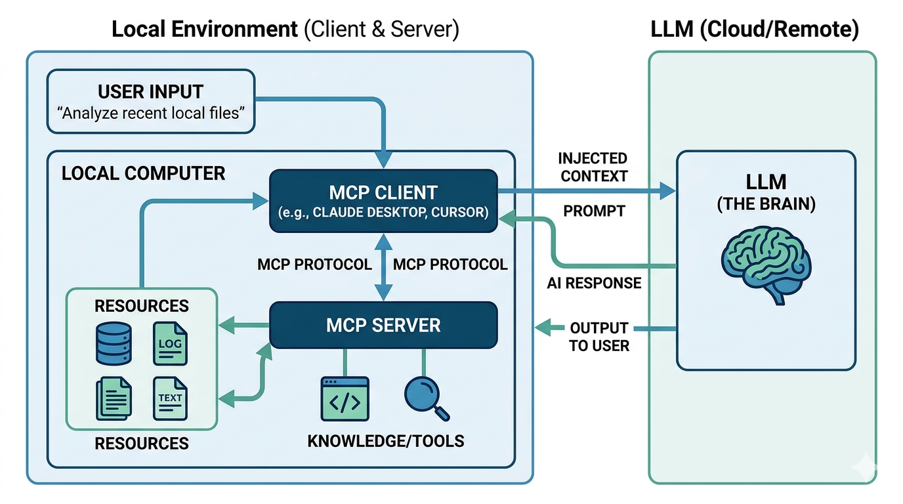
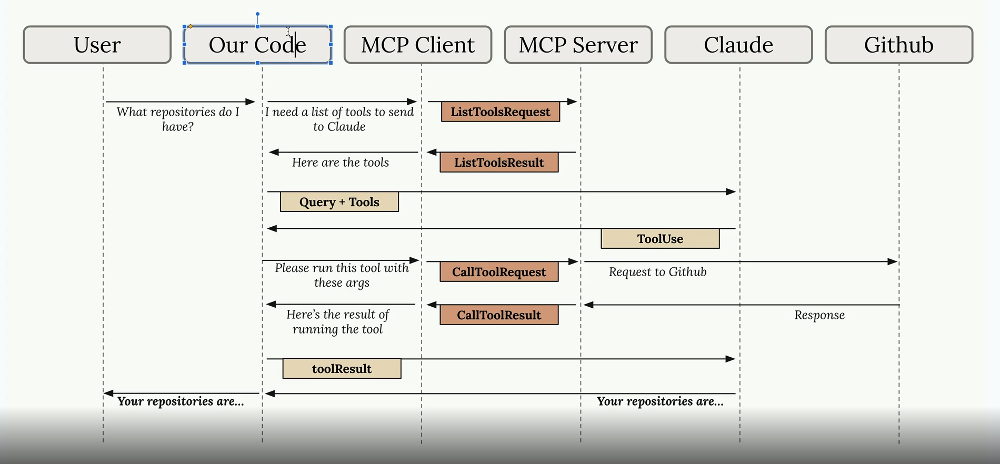
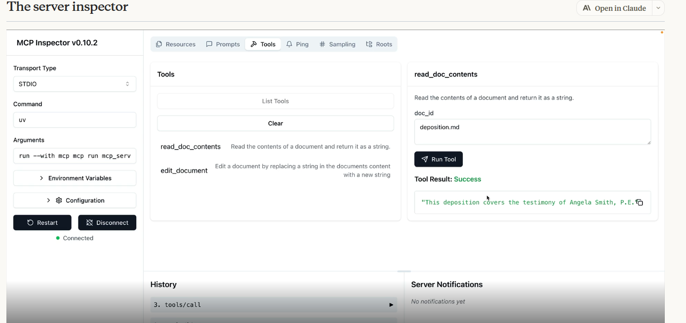
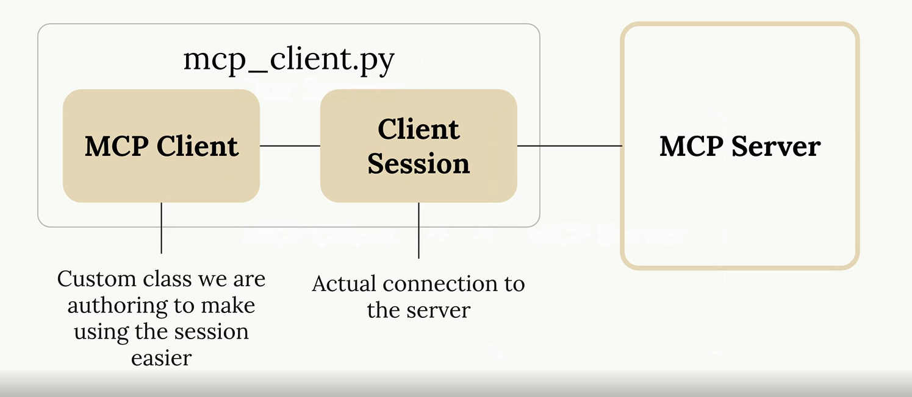

To master RAG (Retrieval-Augmented Generation) and Agentic AI, you need to transition from building "static" pipelines that just answer questions to "dynamic" systems that can plan, use tools, and reason.

Think of **RAG** as giving the AI a library to look things up, and **Agentic AI** as giving that AI the ability to decide *which* book to open, when to search the web instead, and how to verify its own work.

---

## 🛠️ Phase 1: The RAG Foundation (Month 1)

Before the AI can act, it needs to know how to "read." Focus on how to connect an LLM to private data.

* **Core Concepts:**
* **Embeddings & Vector Databases:** Understand how text becomes math. Learn tools like **ChromaDB**, **Pinecone**, or **Weaviate**.
* **The Pipeline:** Learn the "Load → Chunk → Embed → Retrieve → Generate" flow.
* **Chunking Strategies:** How you split a 100-page PDF matters. Learn semantic vs. recursive character splitting.


* **Tools to Learn:**
* **Frameworks:** LangChain or LlamaIndex (LlamaIndex is often preferred for data-heavy RAG).
* **Evaluation:** Learn **Ragas** or **TruLens** to measure if your RAG is actually accurate (hallucination detection).


---

## 🤖 Phase 2: Introduction to Agents (Month 2)

Now, move from a linear flow to a "loop" where the AI thinks before it speaks.

* **Core Concepts:**
* **Tool Use (Function Calling):** Teaching an LLM to "call" a Python function or an API.
* **Reasoning Loops:** Study the **ReAct** pattern (Reason + Act). The agent writes a "Thought," takes an "Action," and makes an "Observation."
* **Memory:** Distinguish between *Short-term* (conversation history) and *Long-term* (recalling user preferences across weeks).


* **Frameworks to Explore:**
* **LangGraph:** Currently the industry standard for building controllable, stateful agents.
* **CrewAI / Agno:** Great for "Multi-Agent" setups where you have a "Researcher" agent and a "Writer" agent working together.


---

## 🚀 Phase 3: Agentic RAG (Month 3)

This is the "Pro" level. Instead of a simple search, the agent decides *how* to search.

* **Key Techniques:**
* **Self-RAG:** The agent looks at the retrieved data and asks: "Is this enough to answer the question?" If not, it searches again.
* **Corrective RAG (CRAG):** The agent identifies if the retrieved info is irrelevant and triggers a web search as a fallback.
* **Planning:** The agent breaks a complex prompt (e.g., "Compare the Q3 earnings of Apple and Microsoft") into sub-tasks.


---

## 📚 Recommended Resources

| Resource | Best For... |
| --- | --- |
| **DeepLearning.AI (Short Courses)** | Fast, 1-hour lessons on LangChain and Multi-Agent systems. |
| **LlamaIndex "RAG from Scratch"** | Understanding the low-level mechanics of retrieval. |
| **LangChain YouTube / Blog** | Staying updated on **LangGraph** (the current meta for agents). |
| **Full Stack Retrieval (GitHub)** | Seeing how to deploy these into real apps. |

---

## 💡 Pro-Tip for Starting

Don't just read—**build a "Personal Research Assistant."** 1.  **Level 1:** Make it answer questions from your local PDFs (Basic RAG).
2.  **Level 2:** Give it a "Search Tool" (Tavily or DuckDuckGo) to use if the PDFs don't have the answer (Agentic).
3.  **Level 3:** Give it a "Writer Tool" to save the summary into a markdown file (Tool Use).

# Agentic AI

The shift from RESTful API design to Agentic AI is a move from "Instruction-Following" to "Goal-Seeking." In a RESTful world, you are the architect providing a map; in an Agentic world, you are a manager providing a mission.

## Pip command
```python
# Run script
python main.py

# install package
pip install numpy

# install dependencies 
pip install -r requirements.txt

# spin up an existing project
python -m venv .venv
source .venv/bin/activate
pip install -r requirements.txt

# capturing dependencies
pip freeze > requirements.txt

```

## UV command
```python
# Run script
un run main.py

# install package
un add numpy

# install dependencies 
un add -r requirements.txt

# spin up an existing project
uv sync

# capturing dependencies
(captures automatically)

# create new project
uv init
```

# MCP

MCP Client ---> MCP Server





References: 
- [MCP Antropic Sample Project](./Reference%20Projects/MCP_Project_Antropics/README.md)

## MCP Server 
```python
from pydantic import Field
from mcp.server.fastmcp import FastMCP

mcp = FastMCP("DocumentMCP", log_level="Error")

docs = {
    "doc1": "This is the content of document 1",
    "doc2": "This is the content of document 2"
}

# Create a tool
# Python MCP SDK, will convert this tool to JSON format, having different decorators, description, more information helps LLM 
@mcp.tool(
    name="read_doc_contents",
    description="Read the contents of a document and return it as a string." # this description will be used by LLM to identify when to use this tool, so it should be clear
)
# This is the function to call, when MCP client invokes this tool
def read_document(
    doc_id: str = Field(description="Id of the document to read")
):
    # first handle not found use cases, so LLM can handle this gracefully
    if doc_id not in docs:
        raise ValueError(f"Doc with id {doc_id} not found")
    return docs[doc_id]

@mcp.tool(
    name="edit_docs_contents",
    description="Edit the contents of a document."
)
def edit_document(
    doc_id: str = Field(description="Id of the document to edit"),
    new_content: str = Field(description="New content for the document")
):
    if doc_id not in docs:
        raise ValueError(f"Doc with id {doc_id} not found")
    docs[doc_id] = new_content
    return f"Document {doc_id} updated successfully"
```
To Test MCP server locally, run below command:

```script
mcp dev mcp_server.py
```


## MCP Client



```python
# List tools
async def list_tools():
    result = await self.session().list_tools()
    return result.tools

# Call tools
async def call_tool(tool_name: str, tool_input: dict):
    result = await self.session().call_tool(tool_name, tool_input)
    return result
```