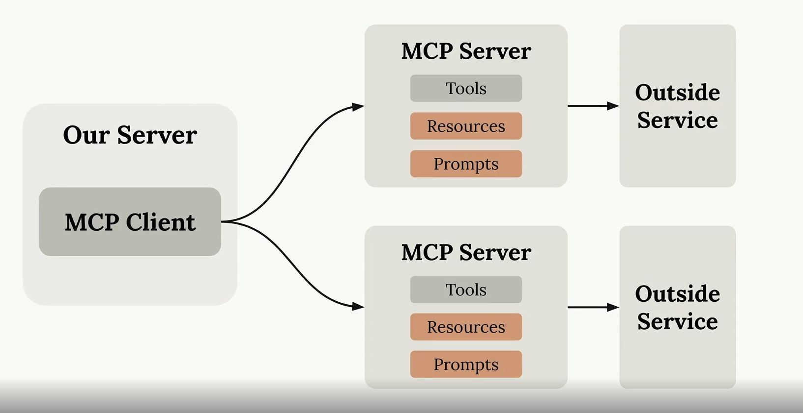
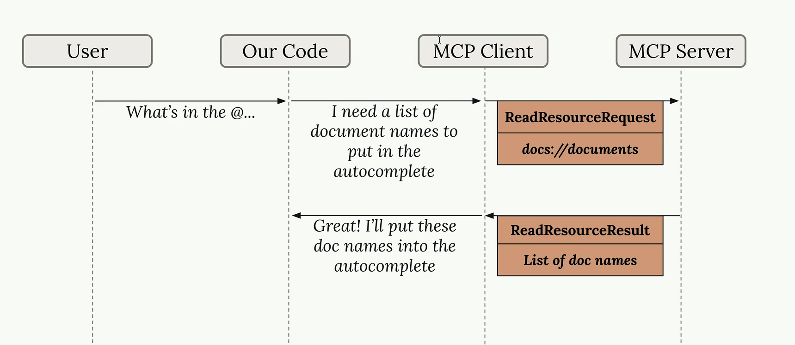
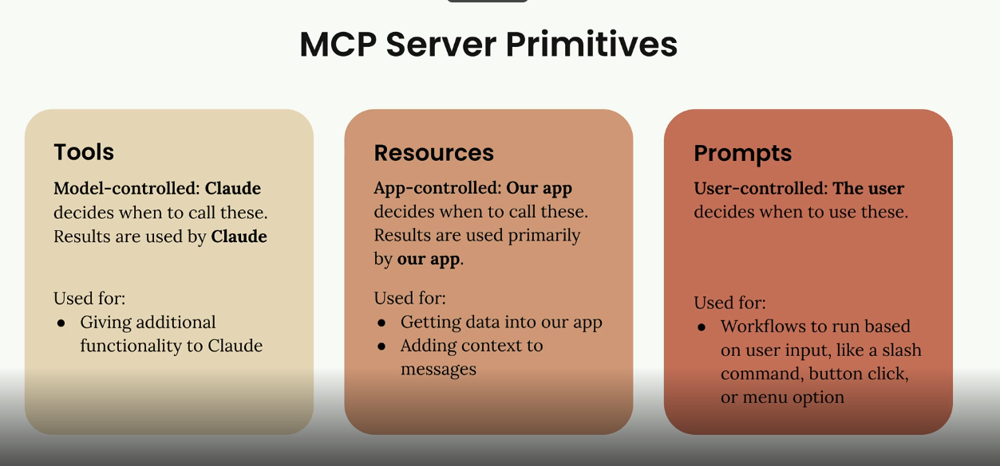

# Table of Contents

- [🛠️ Phase 1: The RAG Foundation (Month 1)](#️-phase-1-the-rag-foundation-month-1)
  - [Core Concepts](#core-concepts)
  - [Tools to Learn](#tools-to-learn)
- [🤖 Phase 2: Introduction to Agents (Month 2)](#-phase-2-introduction-to-agents-month-2)
  - [Core Concepts](#core-concepts-1)
  - [Frameworks to Explore](#frameworks-to-explore)
- [🚀 Phase 3: Agentic RAG (Month 3)](#-phase-3-agentic-rag-month-3)
  - [Key Techniques](#key-techniques)
- [📚 Recommended Resources](#-recommended-resources)
- [💡 Pro-Tip for Starting](#-pro-tip-for-starting)
- [Agentic AI](#agentic-ai)
- [Pip command](#pip-command)
- [UV command](#uv-command)
- [MCP](#mcp)
  - [Introducing MCP](#introducing-mcp)
  - [MCP Clients](#mcp-clients)
  - [Project Setup](#project-setup)
  - [The Server Inspector](#the-server-inspector)
  - [MCP Server](#mcp-server)
    - [Defining Tools with MCP](#defining-tools-with-mcp)
  - [MCP Client](#mcp-client)
    - [Implementing a Client](#implementing-a-client)
  - [Resources](#resources)
    - [Accessing Resources](#accessing-resources)
  - [Prompts](#prompts)
    - [Prompts in the Client](#prompts-in-the-client)
  - [MCP Review](#mcp-review)

---

To master RAG (Retrieval-Augmented Generation) and Agentic AI, you need to transition from building "static" pipelines that just answer questions to "dynamic" systems that can plan, use tools, and reason.

Think of **RAG** as giving the AI a library to look things up, and **Agentic AI** as giving that AI the ability to decide *which* book to open, when to search the web instead, and how to verify its own work.

---

## 🛠️ Phase 1: The RAG Foundation (Month 1)

Before the AI can act, it needs to know how to "read." Focus on how to connect an LLM to private data.

* **Core Concepts:**
* **Embeddings & Vector Databases:** Understand how text becomes math. Learn tools like **ChromaDB**, **Pinecone**, or **Weaviate**.
* **The Pipeline:** Learn the "Load → Chunk → Embed → Retrieve → Generate" flow.
* **Chunking Strategies:** How you split a 100-page PDF matters. Learn semantic vs. recursive character splitting.


* **Tools to Learn:**
* **Frameworks:** LangChain or LlamaIndex (LlamaIndex is often preferred for data-heavy RAG).
* **Evaluation:** Learn **Ragas** or **TruLens** to measure if your RAG is actually accurate (hallucination detection).


---

## 🤖 Phase 2: Introduction to Agents (Month 2)

Now, move from a linear flow to a "loop" where the AI thinks before it speaks.

* **Core Concepts:**
* **Tool Use (Function Calling):** Teaching an LLM to "call" a Python function or an API.
* **Reasoning Loops:** Study the **ReAct** pattern (Reason + Act). The agent writes a "Thought," takes an "Action," and makes an "Observation."
* **Memory:** Distinguish between *Short-term* (conversation history) and *Long-term* (recalling user preferences across weeks).


* **Frameworks to Explore:**
* **LangGraph:** Currently the industry standard for building controllable, stateful agents.
* **CrewAI / Agno:** Great for "Multi-Agent" setups where you have a "Researcher" agent and a "Writer" agent working together.


---

## 🚀 Phase 3: Agentic RAG (Month 3)

This is the "Pro" level. Instead of a simple search, the agent decides *how* to search.

* **Key Techniques:**
* **Self-RAG:** The agent looks at the retrieved data and asks: "Is this enough to answer the question?" If not, it searches again.
* **Corrective RAG (CRAG):** The agent identifies if the retrieved info is irrelevant and triggers a web search as a fallback.
* **Planning:** The agent breaks a complex prompt (e.g., "Compare the Q3 earnings of Apple and Microsoft") into sub-tasks.


---

## 📚 Recommended Resources

| Resource | Best For... |
| --- | --- |
| **DeepLearning.AI (Short Courses)** | Fast, 1-hour lessons on LangChain and Multi-Agent systems. |
| **LlamaIndex "RAG from Scratch"** | Understanding the low-level mechanics of retrieval. |
| **LangChain YouTube / Blog** | Staying updated on **LangGraph** (the current meta for agents). |
| **Full Stack Retrieval (GitHub)** | Seeing how to deploy these into real apps. |

---

## 💡 Pro-Tip for Starting

Don't just read—**build a "Personal Research Assistant."** 1.  **Level 1:** Make it answer questions from your local PDFs (Basic RAG).
2.  **Level 2:** Give it a "Search Tool" (Tavily or DuckDuckGo) to use if the PDFs don't have the answer (Agentic).
3.  **Level 3:** Give it a "Writer Tool" to save the summary into a markdown file (Tool Use).

# Agentic AI

The shift from RESTful API design to Agentic AI is a move from "Instruction-Following" to "Goal-Seeking." In a RESTful world, you are the architect providing a map; in an Agentic world, you are a manager providing a mission.

## Pip command
```python
# Run script
python main.py

# install package
pip install numpy

# install dependencies 
pip install -r requirements.txt

# spin up an existing project
python -m venv .venv
source .venv/bin/activate
pip install -r requirements.txt

# capturing dependencies
pip freeze > requirements.txt

```

## UV command
```python
# Run script
un run main.py

# install package
un add numpy

# install dependencies 
un add -r requirements.txt

# spin up an existing project
uv sync

# capturing dependencies
(captures automatically)

# create new project
uv init
```

# MCP

## Introducing MCP

**MCP = Model Context Protocol**, communication layer providing Claude with context and tools without requiring developers to write tedious code.

### Core Architecture
- MCP client connects to MCP server
- MCP server contains tools, resources, and prompts as internal components

### Why we need tools, resources, prompts? Why MCP?
I'll explain why we need tools, resources, prompts, and MCP by examining the current context and providing a comprehensive answer.

Based on your notes, I can see you already have excellent documentation on MCP. Let me provide a concise explanation of why we need tools, resources, prompts, and MCP:

## Why We Need Tools, Resources, Prompts & MCP

### **The Problem**
Traditional AI development requires developers to manually write tool schemas and implementations for every service integration. This creates significant maintenance burden.

### **MCP Solution**
**MCP (Model Context Protocol)** shifts this burden from developers to dedicated MCP servers that provide pre-built tools, resources, and prompts.

## Three Core Components

### **Tools** - Model-Controlled
- **Purpose**: Give Claude capabilities it doesn't have natively
- **When to use**: Need Claude to execute actions (API calls, calculations, file operations)
- **Control**: Claude decides when to use them
- **Example**: JavaScript execution, GitHub API calls

### **Resources** - App-Controlled  
- **Purpose**: Expose data to applications
- **When to use**: Need data for UI display or prompt augmentation
- **Control**: Application code decides when to fetch
- **Example**: Document listings, autocomplete options

### **Prompts** - User-Controlled
- **Purpose**: Pre-defined workflows for users
- **When to use**: Reusable AI instructions with dynamic content
- **Control**: User triggers via slash commands or buttons
- **Example**: "/format document" command

## Key Benefits

1. **Eliminates Manual Tool Creation** - No more writing JSON schemas for each API
2. **Reduces Maintenance** - Service providers maintain official MCP servers
3. **Standardized Interface** - Consistent communication protocol across services
4. **Separation of Concerns** - Clear boundaries between model, app, and user control

## Real-World Impact

Instead of writing custom GitHub integration code, you connect to a GitHub MCP server that already provides all the tools, resources, and prompts needed - saving development time and reducing bugs.

The core value is **outsourcing tool creation to specialists** while you focus on building your application's unique features.

### Problem Solved
Traditional approach requires developers to manually author tool schemas and functions for each service integration (like GitHub API tools). This creates maintenance burden for complex services with many features.

### MCP Solution
Shifts tool definition and execution from developer's server to dedicated MCP server. MCP server = interface to outside service, wrapping functionality into pre-built tools.

### Key Benefits
- Eliminates need for developers to write/maintain tool schemas and function implementations
- Someone else authors the tools, packages them in MCP server

### Common Questions
- **Who authors MCP servers?** Anyone, but often service providers create official implementations
- **Difference from direct API calls?** Saves developer time by providing pre-built tool schemas/functions instead of manual authoring
- **Relationship to tool use?** MCP and tool use are complementary, not identical. MCP focuses on who does the work of creating tools

### Core Value
Reduces developer burden by outsourcing tool creation to MCP server implementations rather than requiring custom tool development for each service integration.

## MCP Clients

**MCP Client =** communication interface between your server and MCP server, provides access to server's tools.

### Transport Agnostic
Client/server can communicate via multiple protocols (stdin/stdout, HTTP, WebSockets, etc). Common setup: both on same machine using stdin/stdout.

### Communication
Message exchange defined by MCP spec. Key message types:
- **list tools request/result** = client asks server for available tools, server responds with tool list
- **call tool request/result** = client asks server to run tool with arguments, server returns execution result

### Typical Flow
1. User query → Server asks MCP client for tools
2. MCP client sends list tools request to MCP server
3. Server gets tool list → Server sends query + tools to Claude
4. Claude requests tool execution → Server asks MCP client to run tool
5. MCP client sends call tool request to MCP server
6. MCP server executes tool (e.g., GitHub API call)
7. Results flow back through chain → Claude formulates final response → User gets answer

MCP client acts as intermediary - doesn't execute tools itself, just facilitates communication between your server and MCP server that actually runs the tools.

## Project Setup

**MCP Learning Project =** CLI-based chatbot implementing both client and server components for educational purposes.

### Project Structure
- Custom MCP client connects to custom MCP server, both built in same project

### Document System
- Fake documents stored in memory only, no persistence

### Server Tools
Two tools implemented:
1. Read document contents
2. Update document contents

### Real-world Context
Normally projects implement either client OR server, not both. This project does both for learning.

### Setup Requirements
- Download CLI_project.zip, extract
- Configure .env with API key
- Install dependencies

### Running Project
- `"uv run main.py"` (with UV) or `"python main.py"` (without UV)

### Verification
Chat prompt appears, responds to basic queries like "what's one plus one".

## The Server Inspector

**MCP Inspector =** in-browser debugger for testing MCP servers without connecting to actual applications

### Access
Run `mcp dev [server_file.py]` in terminal with activated Python environment → opens server on port → visit provided localhost address

### Interface
- Left sidebar with Connect button
- Top navigation bar shows Resources/Prompts/Tools sections
- Tools section lists available tools
- Click tool to open right panel for manual testing

### Testing Process
1. Select tool
2. Input required parameters (like document ID)
3. Click Run Tool
4. Verify output/success message

### Key Features
- Live development testing
- Tool invocation simulation
- Parameter input fields
- Success/failure feedback

### Status
Inspector in active development - UI may change but core functionality remains similar

### Usage Pattern
Essential for MCP server development and debugging before production deployment

MCP Client ---> MCP Server




References: 
- [MCP Antropic Sample Project](./Reference%20Projects/MCP_Project_Antropics/README.md)

## MCP Server 

### Defining Tools with MCP

#### MCP Server Implementation
Python SDK simplifies tool creation vs manual JSON schemas

#### Tool Definition Syntax
- `@mcp.tool` decorator + function with typed parameters + Field descriptions

#### Document Storage
In-memory dictionary with doc_id keys and content values

#### Tool 1 - read_doc_contents
- Takes doc_id string parameter
- Returns document content from docs dictionary
- Raises ValueError if doc not found

#### Tool 2 - edit_document
- Takes doc_id, old_string, new_string parameters
- Performs find/replace operation on document content
- Includes existence validation

#### MCP Python SDK Benefits
- Auto-generates JSON schemas from decorated functions
- Single line server creation
- Eliminates manual schema writing

#### Parameter Definition
Use Field() with description for tool arguments, import from pydantic

#### Error Handling
- Validate document existence before operations
- Raise ValueError for missing documents

#### Implementation Pattern
Decorator → Function definition → Parameter typing → Validation → Core logic

```python
from pydantic import Field
from mcp.server.fastmcp import FastMCP

mcp = FastMCP("DocumentMCP", log_level="Error")

docs = {
    "doc1": "This is the content of document 1",
    "doc2": "This is the content of document 2"
}

# Create a tool
# Python MCP SDK, will convert this tool to JSON format, having different decorators, description, more information helps LLM 
@mcp.tool(
    name="read_doc_contents",
    description="Read the contents of a document and return it as a string." # this description will be used by LLM to identify when to use this tool, so it should be clear
)
# This is the function to call, when MCP client invokes this tool
def read_document(
    doc_id: str = Field(description="Id of the document to read")
):
    # first handle not found use cases, so LLM can handle this gracefully
    if doc_id not in docs:
        raise ValueError(f"Doc with id {doc_id} not found")
    return docs[doc_id]

@mcp.tool(
    name="edit_docs_contents",
    description="Edit the contents of a document."
)
def edit_document(
    doc_id: str = Field(description="Id of the document to edit"),
    new_content: str = Field(description="New content for the document")
):
    if doc_id not in docs:
        raise ValueError(f"Doc with id {doc_id} not found")
    docs[doc_id] = new_content
    return f"Document {doc_id} updated successfully"
```
To Test MCP server locally, run below command:

```script
mcp dev mcp_server.py
```


## MCP Client

### Implementing a Client

#### MCP Client Implementation

**MCP Client =** wrapper class around client session for connecting to MCP server with resource cleanup management

**Client Session =** actual connection to MCP server from MCP Python SDK, requires cleanup when closing

#### Resource Cleanup
Necessary process when shutting down, handled by connect/cleanup/async enter/async exit functions

#### Client Purpose
Exposes MCP server functionality to rest of codebase, provides interface between application code and server

#### Key Functions
- `list_tools()` = await self.session.list_tools(), return result.tools
- `call_tool()` = await self.session.call_tool(tool_name, tool_input)

#### Implementation Flow
1. Application requests tool list for Claude
2. Client calls list_tools() to get server's available tools
3. Claude selects tool and provides parameters
4. Client calls call_tool() to execute on server
5. Results returned to Claude

#### Testing
Run MCP client.py directly with testing harness to verify connection and tool listing

#### Integration
Once implemented, can run CLI to have Claude use tools (e.g., "what is contents of report.pdf document")

#### Common Practice
Wrap client session in larger class rather than using directly for better resource management


```python
# List tools
async def list_tools():
    result = await self.session().list_tools()
    return result.tools

# Call tools
async def call_tool(tool_name: str, tool_input: dict):
    result = await self.session().call_tool(tool_name, tool_input)
    return result
```

## Resources

**Resources =** MCP server feature that exposes data to clients for read operations

### Resource Types
- **Direct/Static** = static URI (e.g., docs://documents)
- **Templated** = parameterized URI with wildcards (e.g., documents/{doc_id})

### Resource Flow
1. Client sends read resource request with URI
2. MCP server matches URI to resource function
3. Server executes function, returns result
4. Client receives data via read resource result message

### Implementation
- Use @mcp.resource decorator
- Define URI (route-like address)
- Set MIME type (application/json, text/plain, etc.)
- Templated resources: URI parameters become function keyword arguments
- Python MCP SDK auto-serializes return values to strings

### Common Pattern
One resource per distinct read operation (list items vs fetch single item)

### MIME Types
Hints to client about returned data format for proper deserialization

Allow the MCP Server to expose data to the client

Similar to GET request handlers in a typical HTTP Server

Can return any type of data - strings, JSON, binary, etc.
    - We set the 'mime_type' to give the client a hint as to what data we are returning.

Two types: Direct and Templated

```python
# Direct resources
# URI doesn't contain any params
# Always fix response
@mcp.resource(
    uri="doc://documents",
    mime_type="application/json"
)
def list_docs():
    return docs

# Templated resources
# URI contains params
# Python SDK parses these and passes them as args to your functions
@mcp.resource(
    uri="doc://documetns/{doc_id}",
    mime_type="text/plain"
)
def fetch_doc(doc_id: str):
    if doc_id not in docs:
        raise ValueError(f"Doc with id {doc_id} not found")
    return docs[doc_id]
```


## Accessing Resources

### MCP Resource Access
Method for clients to retrieve data from server resources

### Client Implementation
- **read_resource function** = takes URI parameter, requests resource from MCP server
- Uses `await self.session.read_resource(AnyUrl(uri))` for server communication
- Accesses `result.contents[0]` = first resource from returned contents list

### Response Parsing
- Checks resource.mime_type property to determine data format
- If mime_type == "application/json": returns json.loads(resource.text)
- Otherwise: returns resource.text as plain text

### Resource Integration
- MCP client functions called by other application components
- Enables document selection via CLI interface with arrow keys + space
- Selected resource contents automatically included in LLM prompts
- Eliminates need for tools to read document contents during chat

### Key Dependencies
json module, pydantic.AnyUrl for type handling

```python
# call resources from MCP client
import json
from pydantic import AnyUrl

async def read_resource(self, uri: str) -> Any:
    result = await self.session().read_resource(AnyUrl(uri))
    resource = result.contents[0]

    if isinstance(resource, types.TextResourceContents):
        if resource.mimeType == "application/json":
            return json.loads(resource.text)

        return resource.text
```

## Prompts 

**Prompts =** pre-written, tested instructions that MCP servers expose to clients for specialized tasks

### MCP Prompts Feature
- Servers define high-quality prompts tailored to their domain
- Clients can access these prompts via slash commands (e.g., /format)
- Alternative to users writing their own prompts manually

### Implementation Pattern
- Use @prompt decorator with name and description
- Function receives arguments (e.g., document ID)
- Returns list of messages (user/assistant format)
- Messages sent directly to Claude

### Key Benefit
Server authors create optimized, tested prompts rather than leaving prompt quality to end users

### Example Structure
```python
@prompt(name="format", description="rewrites document in markdown")
def format_document(doc_id: str) -> list[messages]:
    return [base.user_message(prompt_text)]
```

### Workflow
User types /format → selects document → server returns specialized prompt → client sends to Claude → Claude uses tools to read/reformat/save document

### Purpose
Encapsulate domain expertise in prompt engineering within specialized MCP servers

## Prompts in the Client

### MCP Client Prompt Implementation

#### List prompts function
`await self.session.list_prompts()`, return result.props

#### Get prompt function
`await self.session.get_prompt(prompt_name, arguments)`, return result.messages

### Prompt Workflow
1. Client requests prompt by name
2. Passes arguments as keyword parameters
3. MCP server interpolates arguments into prompt template
4. Returns formatted messages for AI model

### Arguments Flow
Client arguments → prompt function keyword arguments → interpolated into prompt text (e.g., document_id parameter gets inserted into prompt template)

### Return Format
Messages array that forms conversation input for AI model

### CLI Usage
/format command → select document → prompt with document ID sent to Claude → Claude uses tools to fetch document → returns formatted result

### Key Concept
Prompts are server-defined templates that clients can invoke with parameters, enabling reusable AI instructions with dynamic content insertion.

Users can ask Claude to 'format' a docuemnt as markdown

User will initiate the process by typing a "/" to list out possible commands

User will specify the ID of the document to format

Claude shold read the documents' contents, then print a markdown-formatted version of the document

```python
from mcp.server.fastmcp.prompts import base

@mcp.prompt(
    name="format",
    description="Rewrites the contents of a document in Markdown format"
)
def format_document(doc_id: str
) -> list[base.Message]:
    prmpt = f """
    Your goal is to refomrat a document to be written with markdown syntax.

    The id of the document you need to reformat is:
    <document_id>
    {doc_id}
    </document_id>

    Add in headers, bullet points, tables, etc as necessary. Feel free to add in extra, but don't change meaning.
    Use the 'edit_document' tool to edit the document. After the document has been formated, return the content.
    """
    return [base.UserMessage(prompt)]
```

## MCP Review

### MCP Server Primitives = 3 types: tools, resources, prompts

#### Tools
- **Model-controlled primitives** where Claude decides when to execute them
- Used to add capabilities to Claude (e.g., JavaScript execution for calculations)
- **Serve the model**

#### Resources
- **App-controlled primitives** where application code decides when to fetch data
- Used to get data into apps for UI display or prompt augmentation (e.g., autocomplete options, document listings from Google Drive)
- **Serve the app**

#### Prompts
- **User-controlled primitives** triggered by user actions like button clicks or slash commands
- Used for predefined workflows (e.g., chat starter buttons in Claude interface)
- **Serve users**

### Control Patterns
Control patterns determine purpose:
- **Need Claude capabilities** → implement tools
- **Need app data** → use resources  
- **Need user workflows** → create prompts

### Real Examples
- Claude's chat starter buttons use prompts
- Google Drive document selection uses resources
- Code execution uses tools

